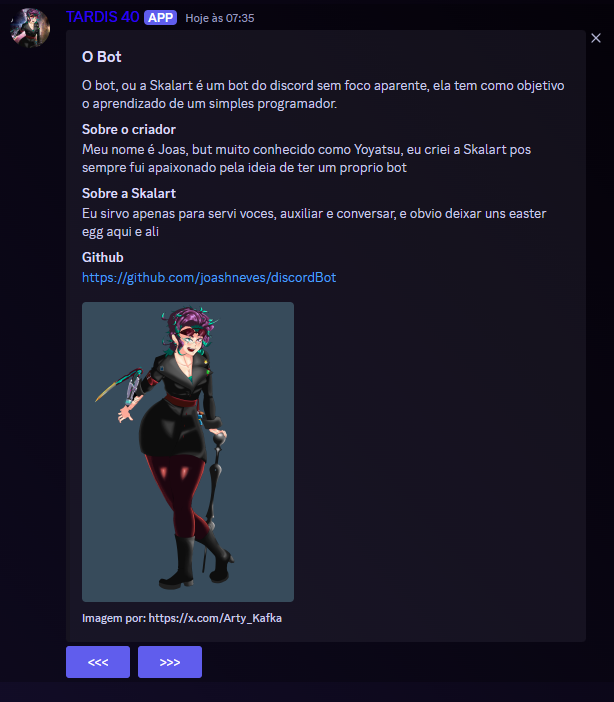
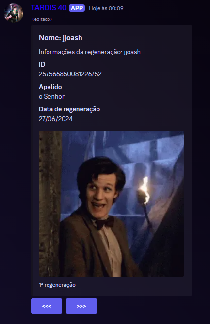
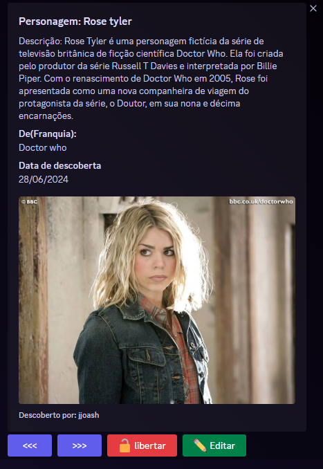

# projeto Skarlet

O projeto skarlet se consiste em criar uma bot um pouco basico, mas nem tão baisco para o discord, mantendo suas funções padroes como, exibir avatar de outro usuario, dizer o ping, exibir emoties, reações personalizadas, e um pouco mais.

### Comandos basicos
Aqui estão alguns comandos atuais que o bot possui, sendo o prefixo por enquanto e por padrão $.
#### $ajuda
Criar uma sessão para exibir os comandos disponiveis em paginas, que explicam os funcionamento do bot.

#### $avatar
Este comando ao ser utilizado cria uma especie de registro do user atual, e ao chama-lo ele disponibiliza uma lista dos avatares adicionado ao registro

#### $jogar 

Esse comando começa o jogo de advinhar personagens, o bot vai lhe entregar um personagem aleatorio, e voce tera que descobri o nome do personagem, assim que voce descobri o nome do personagem que 
apareceu para voce, voce poderar editar suas informações com o comando $score, que exiber uma lista dos personagem do amiguinho.

## Roadmap

- Melhorar alguns comandos
- Adicionar travas de comandos
- Deixa a conversa do bot um pouco mais ativa e humana

## Finalizados
- [ x ] criar uma exibição pra perfil
- [ x ] Criar integração com I.A
- [ x ] Colocar o mini game para rodar

